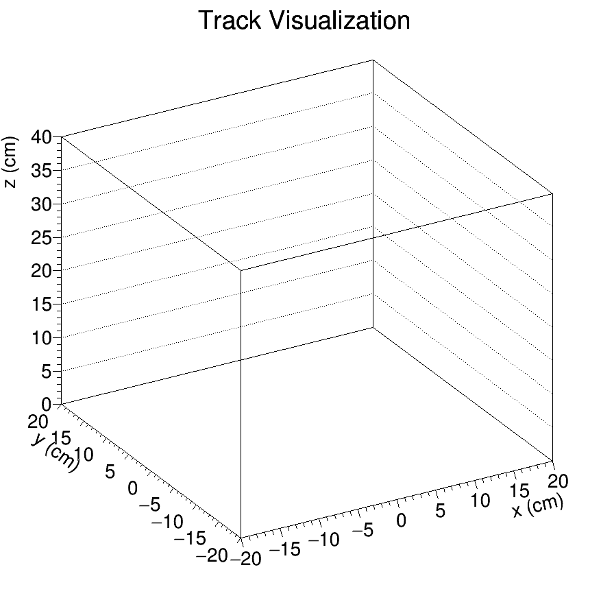
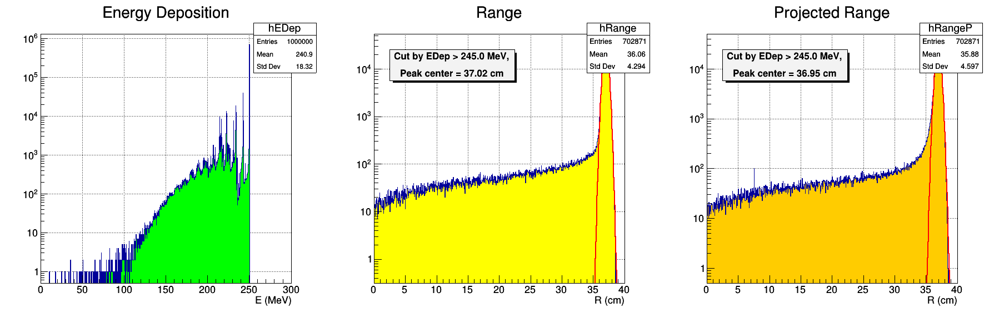

# RangeSim
GEANT4 range simulator. The simulation builds a simple lump of material choosed by user. Then shoot beam directly to the target material. Length of primary particle's traveling will be recorded.

## Installation
* Download it.
```
 git clone [url of this repository]
```
* Build it.
```
mkdir build
cd build
cmake $SOURCE_DIR
make
```

## Run
Edit config.cfg. Then,
```
./rangesim
```

## Scripts
### TrackVis.C
Track visualization. Following is an example of the script output.


### DrawHist.C
Histogram drawing. Following is an example of the script output.


## Known issues
* Linker prints error with some versions. (following list) It seems HepRandom library cannot be found. Please use the latest version of GEANT4.
   * 4.10.03-p03
   * 4.10.04-p01

